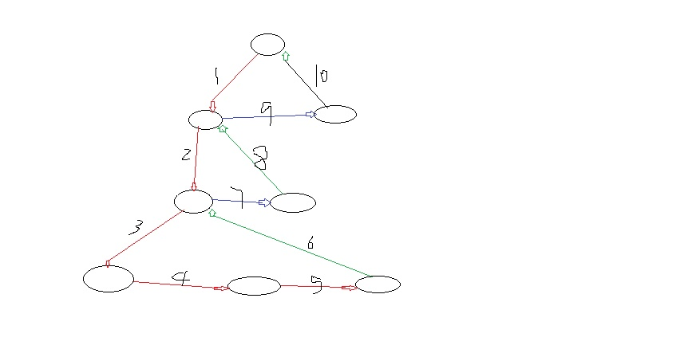

#### fiber

一种全新的描述虚拟DOM的数据结构，让diff的过程，可以被中断，

计算diff的时候，一旦有优先级更高的任务，比如动画，用户交互，会中断diff, 把js的控制权

换回去，进行浏览器的渲染，下次空闲的时候，再继续计算。

* 微观，将树改造成了链表，之前只能用props.children递归来遍历，不好中断。

* 父元素=》第一个子元素=》兄弟元素

     先找子元素没有了，找下一个兄弟元素

     下一个兄弟元素没了，返回到父元素

    



``` js
// 之前的树的递归过程，不容易被中断，之前的diff就是一个同步任务，这个任务根据业务量的多少，可大可小，大会卡。
// fiber相当于把diff拆成了以单个虚拟dom节点的任务队列，通过空闲时间的调度逻辑，控制任务的执行，结果=diff计算量没有减少，但是用户感觉很流畅，不卡顿。
{
  type: "div",
  function
  props: {
    id,
    childern: [{
      type,
      children
    }]
  }
}
//后来
{
  type: div or
  function,
  child: '第一个子元素'
  slibling: '下一个兄弟元素'
  return '父元素'
}
```

#### requestIdleCallback

利用浏览器的空闲时间，执行函数，具有兼容性问题，react使用

``` js
messageChannel requestAnimationFrame setTmeout等一起模拟的
```

* 时间切片 time-sliceing

  最后一次任务执行时间过长，js占用浏览器主线程时间过长，浏览器没有办法，只会卡死，

  主动返还，如果不还了。浏览器也没办法，所以切片，一定要切的颗粒度够细就行

``` js
// 浏览器流畅基本都是60FPS,1s渲染60次。
// 一帧，16.6ms，一帧时间内，有渲染页面，回流重绘，等，还会有空闲时间。
window.requestIdleCallback(函数cb，)
cb(idleDeadline) {
  idleDeadline是idleCallback函数提供的
  idleDeadline.timeRemaining() 获取当前帧还剩下的时间
}
const task = ['任务1', '任务2', '任务3'] //diff任务，有很多节点
//task.forEach(t=>执行任务(t))
function workLoop(deadline) {
  while (tasks.length > 0 && deadline.timeRemaing() > 1) {
    const task = tasks.pop()
    执行任务(task)
  }
  if (tasks.length === 0)
    // diff结束，准备提交修改

    // task还有，但是当前帧没时间了，把控制权交回去，等待下一次的空闲时间
    window.requestIdleCallback(workLoop)
}
```

#### 解决卡顿问题

generator  实现任务中断，react尝试过，太复杂

web-worker 异步文件 ms级别的难以控制

requestIdleCallback  react没有减少任务量，利用空闲时间

Vue: 响应式+vdom 核心逻辑是控制任务的颗粒度 vdom控制在组件内部

#### react

React负责逻辑控制，数据转化为---Vdom

ReactDom渲染实际DOM，vdom-dom

React使用jsx来描述UI 

babel-loader将jsx编译为相应的js对象，React再把这个对象构造成React需要的Vdom

* 属性

​       静态属性用""  动态值用花括号{}

* css模块化

``` ht
  import style from index.module.css
  
  
  ```

* setState只有在合成事件和生命周期函数中是一步的，在原生事件和setTimeout都是同步到，这里的

  异步指的是批量更新

* 组件通信

  props ------ 父子组件相互通信

  父组件传递函数---子组件传入参数，称为状态提升

* 生命周期

  componentWillReceiveProps: 只有在已挂载的组件的props更新之前执行，即初始化时不会执行

  17以后，使用getDeriveStateFromProps代替componentWillMount componentWillReceiveProps componentWillUpdate

  引入两个新的生命周期函数

  static getDerivedStateFromP rops(props, state) : 会在调用render方法之前调用，并且在初始化挂载及后续更新时

  都会被调用，它应返回一个对象来更新state, 如果返回null则不对state拦截，该是啥样就是啥样。 

  getSnapshotBeforeUpdate(prevProps, prevState): 在render之后，在componentDidUpdate之前

  在最近的一次渲染输出(提交到DOM节点)之前调用，它使组件能在发生更改之前从DOM中捕获一些信息(滚动位置)，此声明周期的任何返回值都将作为参数传递给componentDidUpdate()

* Context

``` jsx
  <Provider value={store}>
     // 此时的ctx就是传递进来的store
     <Consumer>{ctx=><Home {...ctx}></Home>}</Consumer>
  </Provider>
  ```

* Redux

  数据管理，

  1. 需要一个store来存储数据

  2. store里的reducer初始化state并定义state的修改guiz
  3. 通过dispatch的一个action来提交对数据的修改
  4. action提交到reducer函数里，根据传入的action的type,放回新的state
  5. 中间件就是一个函数，对store.dispatch方法进行改造，在发出Action和执行Reducer  这两步之间，添加了其他功能
  6. 但是每次都要手动的订阅,this.forceupdate强制更新，getState()获取值，low

* React-Redux

  1. Provider为后代提供store
  2. connect为组件提供数据和变更方法
  3. useState保存moreProps
  4. useEffect订阅，当触发dispatch方法时，setMoreProps拿到最新的props，更新组件。

* React-router

  react-router中奉行一切皆组件的思想

  children>component>render(根据条件去渲染不同的内容)

  children: 不管路由匹不匹配都执行，渲染都是直接执行函数

  渲染component时会调用React.createElement, 如果使用不当, 使用匿名函数的的形式，每次都会生成一个新的匿名函数，导致生成的组件的type值总不相同，会产生重复的卸载和挂载。

``` js
  < Route component = {
    () => < Foo / >
  }
  />
```

  1. switch 独占路由 404写在最后 <Route render={()=><div>404</div>}<Route>

* redux-saga

  action依然是对象

  generator: 函数体内使用return结束 yield是一个暂停函数

  是异步获取数据，访问浏览器缓存等的库，让副作用管理更容易，执行更高效

  run(监听saga), 监听若干的action--->有action动作进来--->判断是否是监听的action(在不在saga动作清单中

  )==>若在，执行saga对应的工作saga===>若不在，直接放过，去执行redux中的任务。

  saga中监听的动作名字不能与reducer中的动作名字相同

  在 saga 的 Middleware 中，可以使用 takeEvery 或者 takeLatest 等 API 来监听某个 action ，当某个 action 触发后， saga 可以使用 call 发起异步操作，操作完成后使用 put 函数触发 action ，同步更新 state ，从而完成整个 State 的更新。

​       call: 调用异步操作（函数名，参数）, 调用其他方法，必须等待该函数执行完，才会继续向下执行

​       put: 状态更新, redux框架中的dispacth函数 阻塞

​       take:take函数可以理解为监听未来的action Generator会暂停，直到一个与pattern匹配的action被发起，

​       才会  继续执行下面的语句

​       fork: 但是fork函数是非阻塞函数，也就是说，程序执行完 `yield fork(fn， args)` 这一行代码后，

​       会立即接  着执行下一行代码语句，而不会等待fn函数返回结果后，在执行下面的语句

​       takeEvery: 做saga监听

``` js
import createSagaMiddleware from 'redux-saga'
import mySaga from './sagas'

1. 创建saga中间件

const sgagMiddleWare = new createSagaMiddleware()

2. 引入中间件

applyMiddleware(sgagMiddleWare)

3. 监听任务清单

sgagMiddleWare.run(mySaga)
```

``` js
takeEvery源码
const takeEvery = (patten, saga, ...args) {
  fork(function*() {
    while (true) {
      const action = yield take(pattern);
      yield fork(saga, ...args.concat(action))
    }
  })
}

takeLatest源码
const takeLatest = (patten, saga, ...args) => {
  fork(function*() {
    let lastTask
    while (true) {
      const action = yield take(patten)
      if (lastTask) {
        yield cancel(lastTask)
      }
      lastTask = yield fork(saga, ...args.concat(action))
    }
  })
}
```

* dva

  1. Model模型

     + state状态
     + action
     + dispatch
     + reducer
     + effect处理异步 vuex action的操作，通过触发action才可以调用reducer实现对state的间接操作

2. Subscripition: 特殊的事件的发出，浏览器，键盘灯，发出dispatch，去发出action
3. route路由可配置

* Page: 负责与用户直接打交道，渲染页面，接受用户的操作输入，侧重于展示型

* Model负责处理业务逻辑，为Page做数据，状态的读写，变换、暂存

* Service 负责与HTTP接口对接，进行纯粹的数据读写

# React新特性

#### context 提供一种方式，能够让数据在组件树中传递而不必一级以及的的手动传递

``` js
const BatteryContext = createContext(defaultValue);
defaultValue： 是为了当consumer找不到provider时， 提供的默认值

存在多个Context时直接嵌套， 顺序不重要
接受一个value值， 并将该值传递下去
  <
  BatteryContext.Provider value = {
    battery
  } >
  <
  OnlineContext.Provider value = {
    online
  } >
  <
  button onClick = {
    () => this.setState({
      battery: battery + 1
    })
  } > Press < /button> <
button onClick = {
  () => this.setState({
    online: !online
  })
} > Online < /button> <
Middle / >
  <
  /OnlineContext.Provider> < /
BatteryContext.Provider >

  <
  BatteryContext.Consumer > {
    接受一个回调函数， 参数为provider传递进来的value值 多个consumer之间可以嵌套， 回调函数中的嵌套
    battery => ( <
      OnlineContext.Consumer > {
        将boolean值转为string， boolean值渲染不出来。
        online => < h1 > Battery: {
          battery
        }-- --online: {
          String(online)
        } < /h1>
      } <
      /OnlineContext.Consumer>
    )
  } <
  /BatteryContext.Consumer>
```

contextType
简化了consumer的包裹接受参数

``` js
static contextType = BatteryContext;
render() {
  const {
    battery,
    online
  } = this.context;
  return ( <
    h1 > Battery: {
      battery
    }-- --online: {
      String(online)
    } < /h1>   
  )
}
```

## lazy Suspense ErrorBoundary

在react中，判断一个组件是否被引用，就是根据一个组件是否被渲染
浏览器的 block xxx url，接口就会被阻塞，不让其加载一些文件。主要用于模拟某个接口没有返回情况下出现的一些异常情况

``` js
//webpack打包会将懒加载的组件code spliting 成为一个独立的模块 
const Lazy = lazy(() => import('./Lazy.jsx'))
//webpack在code spliting时根据hide生成lazy.chunk.js名字的模块
const Lazy = lazy(() => import( /*webpackChunkName:"lazy"*/ './Lazy.jsx'))

  //延迟加载，当组件需要时，再去加载对应的组件
  //否则加载fallback中传入的组件 这种加载不能处理接口请求失败的情况
  //fallback只接受组件 {<Com/>}
  <
  Suspense fallback = {
    <
    div > loading < /div>}> <
    Lazy / >
    <
    /Suspense>

    //使用错误边界处理请求接口失败的情况 当捕获到组件发生的错误时，则返回一个值，会合并到组件的state中
    //错误边界是 React 组件，它可以在子组件树的任何位置捕获 JavaScript 错误，记录这些错误，并显示一个备用 UI，而不是使整个组件树崩溃。 错误边界(Error Boundaries) 在渲染，生命周期方法以及整个组件树下的构造函数中捕获错误。

    static getDerivedStateFromError(error) {
      return {
        hasError: true
      };
    }
    render() {
      if (this.state.hasError) {
        return ( <
          div > error < /div>
        )
      }
      return ( <
        >
        <
        Suspense >
        <
        Lazy / >
        <
        /Suspense> < / >
      )
```

## memo

函数式UI渲染组件，此时的mem包裹函数 与pureComponent产生一样的效果

## hooks

### useState()

1. 惰性的初始值

   useState的初始值是惰性的，只会在初次渲染组件的时候起作用。如果state的初始值需用通过复杂计算得到，useState的初始值也可以是一个函数，函数的返回值将是useState的初始值。并且该函数只执行一次

``` js
const [count, setCount] = useState(() => {
  return props.defaultCount || 05
})
```

2. 跳过state更新

调用state的更新函数，传入和当前一样的state时。React会跳过子组件的渲染，以及effect的执行

3. useState的更新函数可以接受函数作为参数，函数的参数是前一状态的初始值

``` js
setCount((prevCount) => {
  return prevCount + 1
})
```

4. setCount句柄只有一个，无论后面子组件渲染几次，句柄只有一个，只产生一个函数。

### useEffect

在组件每次渲染后调用

### useMemo 优化手段 子组件是否在状态不改变时而去渲染

渲染期间运行
一段函数逻辑是否重复执行 需要返回值，返回值参与渲染

``` js
// double科=可作为state渲染，并且只要[条件改变]才去执行回调
const double = useMemo(() => {
  return count * 2
}, [count === 3])
return ( <
  >
  {
    double
  } <
  />
)
```

### useCallback

``` js
当一个函数
const Click = () => {
    console.log('xzxz')
  } <
  Counter Click = {
    Click
  } >

  由于Click函数的句柄， 每次传递给子组件的都不是同一个， 导致子组件会发生重复渲染

使用useMemo将该函数包裹起来， Click函数的句柄每次都一样， 只有当依赖的条件改变时， 才会重新生成一个函数句柄

const [clickCount, setClickCount] = useState(0)

const Click = useMemo(() => {
  return () => {
    setClickCount(clickCount + 1)
  }
}, [clickCount])

由于setClickCount始终只有一个句柄， 可以去除
这样就是当clickCount发生改变 才会重新生成一个Click函数的句柄，

只执行一次， 则Click的句柄永远都只有一个
const Click = useMemo(() => {
  return () => {
    setClickCount((clickCount) => clickCount + 1)
  }
}, [])

const Click = useCallback(() => {
  setClickCount((clickCount) => clickCount + 1)
}, [])

useMemo(() => fn) === useCallback(fn)
```

### useRef

1. 获取子组件(类组件)或者DOM节点的句柄
2. 渲染周期之间共享数据的存储

保存上一次渲染时的数据，并且不会发生改变

``` js
在组价第一初始化时， 保存下来， 当组件由于count发生重新渲染时， 该it值并不会发生改变
let it = useRef();
useEffect(() => {
  it.current = setInterval(() => {
    count++
  }, 1000)
}, [])
useEffect(() => {
  if (count == 10)
    clearInterval(it.current)
})
```
